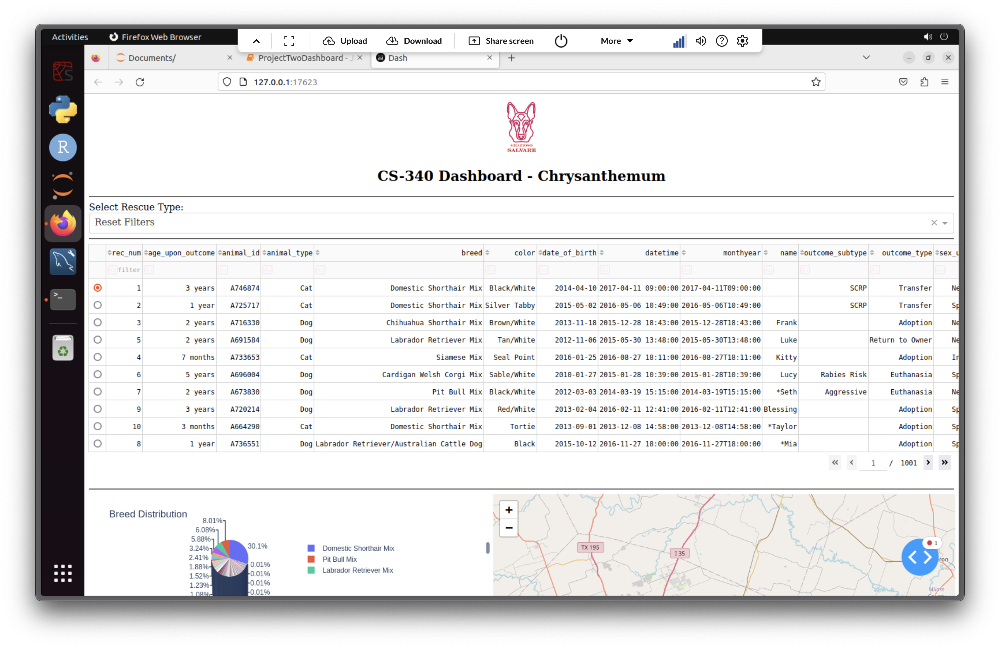
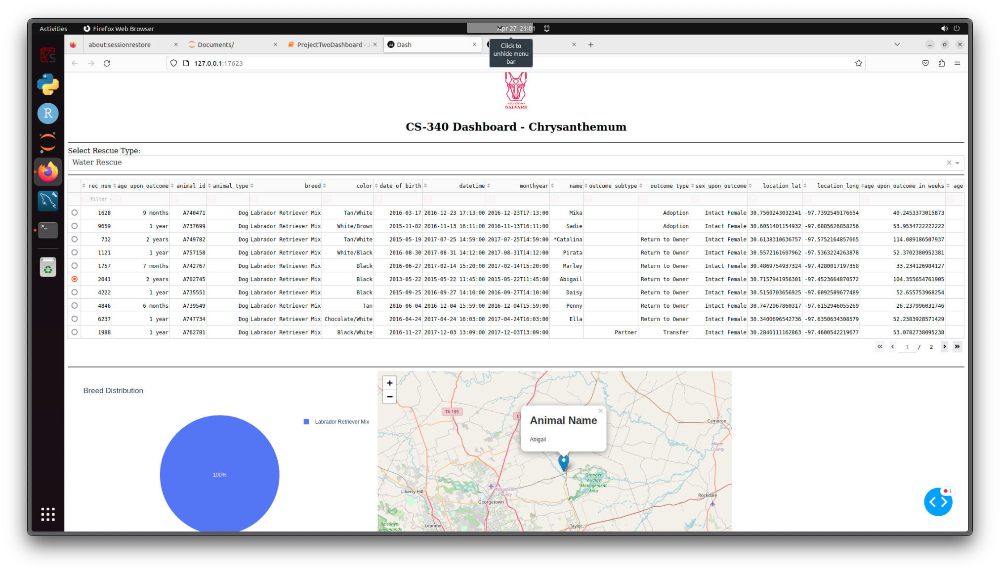
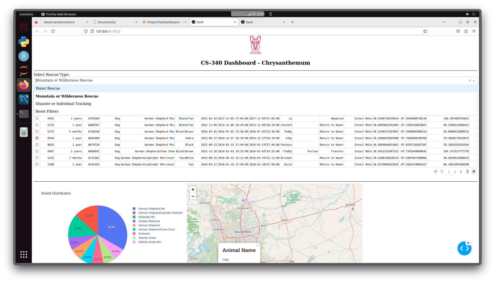
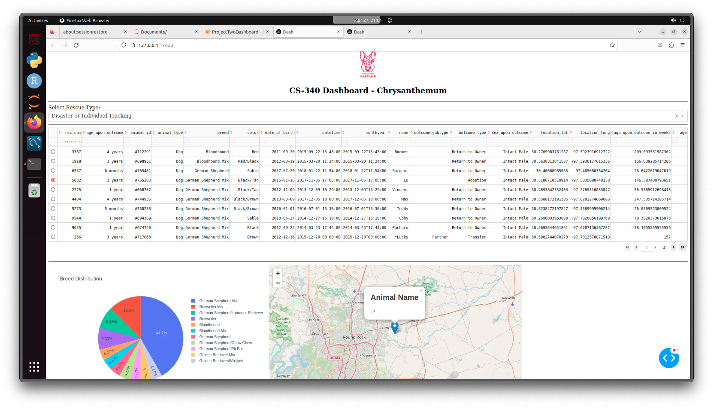

# Grazioso Salvare Animal Rescue Dashboard

## Project Overview
This dashboard was made to help Grazioso Salvare manage and explore their animal rescue data more easily. It has searchable tables, a pie chart that shows breed info, and a map showing where rescued animals are located.

The dashboard handles all the required functionality:

- Pulling rescue data from a MongoDB database.
- Letting users filter animals by rescue type.
- Showing breed distribution in an interactive pie chart.
- Mapping the animals' locations.
- Updating everything in real-time as users interact with it.

## Project Screenshots

---

## Tools and Technologies Used

- **MongoDB**  
  - Stores all the animal rescue records.
  - Flexible document structure = easy to handle different types of data.
  - Used `pymongo` to connect MongoDB with Python.

- **Dash (Plotly)**  
  - Framework for building the dashboard.
  - Keeps the code pretty light and organized.
  - Uses callbacks to update parts of the dashboard when data changes.

- **Dash Leaflet**  
  - Added an interactive map for the animals' locations.

- **Plotly Express**  
  - Made the breed distribution pie charts.
  - Easy to customize and looks good.

- **Pandas**  
  - Helped load, clean, and organize the MongoDB data.

- **Other Libraries**  
  - `base64` (to handle images like the logo)
  - `matplotlib`, `numpy`, `os`, `jupyter_dash`

---

## Resources and Links
- [MongoDB Docs](https://www.mongodb.com/docs/)
- [Dash Docs](https://dash.plotly.com/)
- [Dash Leaflet Docs](https://dash-leaflet.herokuapp.com/)
- [Plotly Express Docs](https://plotly.com/python/plotly-express/)
- [Pandas Docs](https://pandas.pydata.org/docs/)
- [Python Base64 Docs](https://docs.python.org/3/library/base64.html)

---

## Project Steps

1. **Setup**  
   - Wrote a CRUD module (`my_crud.py`) to talk to the MongoDB database.
   - Pulled the rescue data into Pandas and cleaned it up.

2. **Dashboard Layout**  
   - Built a clean layout with Dash HTML components.
   - Added the Grazioso Salvare logo.

3. **Filtering Rescue Types**  
   - Dropdown lets users pick rescue types (Water, Mountain/Wilderness, Disaster/Tracking).
   - Filters update the data shown.

4. **Data Table**  
   - Built with Dash DataTable.
   - Supports filtering, sorting, paging, and row selection.

5. **Breed Pie Chart**  
   - Made an interactive pie chart showing breed distribution.

6. **Location Map**  
   - Map is centered around Austin, TX.
   - Selecting an animal updates its location on the map.

7. **Testing and Deployment**  
   - Tested all features.
   - Took screenshots.

---

## Challenges and Solutions

- **Inconsistent DataFrame References**  
  - Problem: Had trouble getting each app callback function to use the same modified dataframe.
  - Solution: Decided to use the global df dataframe in each function, however I know this not to be best practice. I'm sure with more time I would have gotten the state of the DataTable passed from function to function but I struggled to get that solution working in the allotted time.

---
## Submission Prompts and Answers

- **Q:**
  - How do you write programs that are maintainable, readable, and adaptable? Especially consider your work on the CRUD Python module from Project One, which you used to connect the dashboard widgets to the database in Project Two. What were the advantages of working in this way? How else could you use this CRUD Python module in the future?
- **A:**
  - When I’m writing programs, I try to keep the code as simple and organized as possible. I comment anything that isn’t immediately obvious and I use clear, descriptive names for functions and variables. When I built the CRUD Python module for Project One, I knew I’d be using it again for Project Two, so I made sure to write each function in a way that could handle different cases and stay easy to update. Having that module ready made the dashboard work a lot smoother. I could focus on the dashboard itself without worrying about how the database connections worked. In the future, this CRUD module could be reused in other apps that need to talk to a MongoDB database, or expanded to work with other databases too.

- **Q:**
  - How do you approach a problem as a computer scientist? Consider how you approached the database or dashboard requirements that Grazioso Salvare requested. How did your approach to this project differ from previous assignments in other courses? What techniques or strategies would you use in the future to create databases to meet other client requests?
- **A:**
  - I usually start by breaking the problem into smaller pieces so I don’t get overwhelmed. For Grazioso Salvare’s project, I first made sure I really understood the requirements like which fields needed to show up in the dashboard, or how the filters should work before I wrote any code. Compared to earlier assignments, this one felt more real-world because I had to balance what the client wanted with what was technically possible. In the future, I’d want to spend even more time up front mapping out the data structure and user flow, maybe even sketching a rough wireframe, before touching the code. It saves a lot of back-and-forth later.

- **Q:**
  - What do computer scientists do, and why does it matter? How would your work on this type of project help a company, like Grazioso Salvare, to do their work better?
- **A:**
  - Computer scientists solve problems with technology, but more importantly, they figure out how to make processes faster, easier, and smarter for real people. For a company like Grazioso Salvare, having a tool like the dashboard means they can spend less time digging through paperwork and more time actually helping animals. The work we do behind the scenes setting up databases, building interfaces, making sure everything connects directly impacts how efficiently an organization can do its job. It’s not just about coding; it’s about making a real difference with it for people doing big works.

---

## Author
**Chrysanthemum Gilbert**  
CS-340 | Southern New Hampshire University
