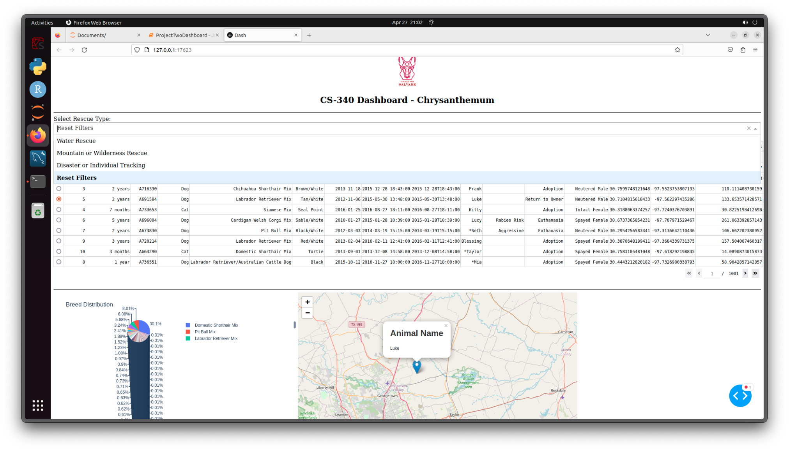

# Grazioso Salvare Animal Rescue Dashboard

## Project Overview
This dashboard was made to help Grazioso Salvare manage and explore their animal rescue data more easily. It has searchable tables, a pie chart that shows breed info, and a map showing where rescued animals are located.

The dashboard handles all the required functionality:

- Pulling rescue data from a MongoDB database.
- Letting users filter animals by rescue type.
- Showing breed distribution in an interactive pie chart.
- Mapping the animals' locations.
- Updating everything in real-time as users interact with it.

## Project Screenshots

---

## Tools and Technologies Used

- **MongoDB**  
  - Stores all the animal rescue records.
  - Flexible document structure = easy to handle different types of data.
  - Used `pymongo` to connect MongoDB with Python.

- **Dash (Plotly)**  
  - Framework for building the dashboard.
  - Keeps the code pretty light and organized.
  - Uses callbacks to update parts of the dashboard when data changes.

- **Dash Leaflet**  
  - Added an interactive map for the animals' locations.

- **Plotly Express**  
  - Made the breed distribution pie charts.
  - Easy to customize and looks good.

- **Pandas**  
  - Helped load, clean, and organize the MongoDB data.

- **Other Libraries**  
  - `base64` (to handle images like the logo)
  - `matplotlib`, `numpy`, `os`, `jupyter_dash`

---

## Resources and Links
- [MongoDB Docs](https://www.mongodb.com/docs/)
- [Dash Docs](https://dash.plotly.com/)
- [Dash Leaflet Docs](https://dash-leaflet.herokuapp.com/)
- [Plotly Express Docs](https://plotly.com/python/plotly-express/)
- [Pandas Docs](https://pandas.pydata.org/docs/)
- [Python Base64 Docs](https://docs.python.org/3/library/base64.html)

---

## Project Steps

1. **Setup**  
   - Wrote a CRUD module (`my_crud.py`) to talk to the MongoDB database.
   - Pulled the rescue data into Pandas and cleaned it up.

2. **Dashboard Layout**  
   - Built a clean layout with Dash HTML components.
   - Added the Grazioso Salvare logo.

3. **Filtering Rescue Types**  
   - Dropdown lets users pick rescue types (Water, Mountain/Wilderness, Disaster/Tracking).
   - Filters update the data shown.

4. **Data Table**  
   - Built with Dash DataTable.
   - Supports filtering, sorting, paging, and row selection.

5. **Breed Pie Chart**  
   - Made an interactive pie chart showing breed distribution.

6. **Location Map**  
   - Map is centered around Austin, TX.
   - Selecting an animal updates its location on the map.

7. **Testing and Deployment**  
   - Tested all features.
   - Took screenshots.

---

## Challenges and Solutions

- **Inconsistent DataFrame References**  
  - Problem: Had trouble getting each app callback function to use the same modified dataframe.
  - Solution: Decided to use the global df dataframe in each function, however I know this not to be best practice. I'm sure with more time I would have gotten the state of the DataTable passed from function to function but I struggled to get that solution working in the allotted time.

---

## Author
**Chrysanthemum Gilbert**  
CS-340 | Southern New Hampshire University
